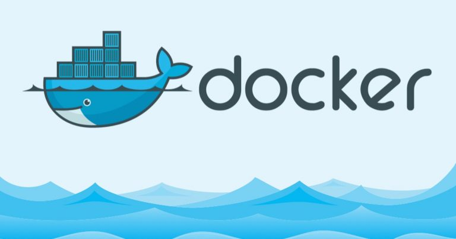
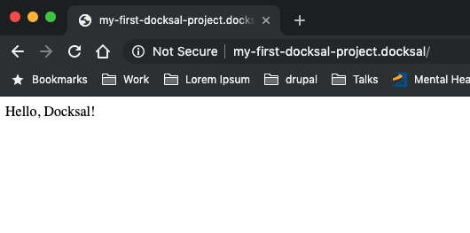

# Section 1 - Introduction {: .page-title}


## Introduction/ index.md {: .page-title}

---
title: "Introduction"
chapter: true
weight: 1
pre: "<b>1. </b>"
---

### Introduction

Thank you for taking the time to read through this training. This training is designed to make Docksal and container-based development more accessible to more people through examples, real world scenarios, and figuring out answers to the tough questions along the way.

So, what are we waiting for? Let's do this!

{}

## About This Training {: .page-title}

---
title: "About This Training"
weight: 1
---

#### Introduction

This training is designed based on the [Docksal Docs](https://docs.docksal.io) with examples and scenarios for using Docksal for local development. This is a hands on training workshop broken down into the following schedule.

* DOCKER OVERVIEW
  * Docker Basics
      * A high-level overview of Docker, how Docker works, and the main components of Docker.
  * Why Containerize?
      * What are the advantages of using containers for development vs local *AMP stacks?
  * Why Use More Than Just Docker?
      * Why should we consider using something more than just Docker to containerize?  What are the advantages to using something like Docksal to wrap up all of our Docker functionality?  In this section we'll go over how using a dev environment like Docksal makes development easier and faster compared to vanilla Docker.
* INTRO TO DOCKSAL
  * What's a Docksal?
      * Where did it come from? Was it handed to us by aliens in hopes that it would change the world one local dev environment at a time? Nope, but we will cover where Docksal came from and what differences there are between Docksal and some of the other containerized dev environments out there.
  * Docksal Stacks
      * Let's take a look at what a stack is and why we have them.
  * Docksal System and Default Services
      * We're going to explore some of the services that come with Docksal and where they're used.
  * Boilerplates and Starterkits
      * It's not just for Drupal! Let's explore a few of the available boilerplate projects that are in the Docksal Github Repo
  * What's in the Container?
      * We're going to explore some of the tools that are included with Docksal straight out of the box. Many should feel very familiar.
* GETTING STARTED
  * Installing Docksal
  * Your First "fin"
      * Let's make sure everything is installed correctly and that you're able to get Docksal running and see the the system information.
  * Starting a new project
      * We're going to use `fin` to spin up a boilerplate project and see what happens.
  * Spinning up a Drupal Site
      * We're going to spin up a basic Drupal 8 site using the Docksal Drupal 8 boilerplate and take a look at some of the things that Docksal needs to run within a Drupal codebase.
  * Customization
      * How to alter settings and configuration to make our system work how we want it to work.
  * Advanced Customization
      * When a stack only gets you 90% of the way there, you might need just a little more to get you the rest of the way.  We'll explore some options for making customizations and tweaking existing services to do what you need them to do.
  * Keep it Local
      * Not all settings need to make it into your repo.  In fact, it's better if some don't so that you don't accidentally push an API key into a public repo. We're going to find out how to make sure we keep private stuff on our local environment only.
  * Adding Docksal to an Existing Project
      * Let's take an existing project that we've been working on and add Docksal to it to mimic our hosting environment.
  * Addons, Addons, Addons
      * Using addons to make your life easier.  We'll explore some of the available addons, what they do, and how to install them.
* GOING FURTHER
  * Docksal: It's Not Just for Local Anymore
      * Let's explore some other uses for Docksal that aren't your local machine. Docksal can be used for CI builds and sandbox environments.
* Q & A AND TROUBLESHOOTING
  * Towards the end of the day we'll open up the conversation and see if there are any unanswered questions or issues that are preventing you from using Docksal in your everyday life.

## Prerequisites {: .page-title}

---
title: "Prerequisites"
weight: 1
---

#### Before we begin...

While this training is designed for all skill levels, here are a few things that will help you have the most success.

* A basic understanding of programming concepts
* An understanding of using the command line
* Having VirtualBox, Docker for Mac, or Docker for Windows installed on your machine prior to training (macOS and Windows users)
* Having Docker installed on your machine prior to training (Linux users)
* A Github account

Also, this training is written from the standpoint of a Linux and macOS user. Many commands should be similar on the Windows version of Docker, however, it should be said that I'm not an expert in Windows and won't be able to offer much in the way of debugging in this training.


# Section 2 - Intro to Docker {: .page-title}


## Intro docker/ index.md {: .page-title}

---
title: "Intro to Docker"
chapter: true
weight: 2
pre: "<b>2. </b>"
---

### Intro to Docker

An overview of what Docker is and how to use it.

{}

## Docker Basics {: .page-title}

---
title: "Docker Basics"
weight: 1
---

{}
The examples in this section use `docker` commands. It is advised that you have your system's native Docker (Docker for Mac, Docker for Windows) installed and running when completing the exercises in this section.
{}


{}

## What is Docker? {: .page-title}

---
title: "What is Docker?"
weight: 1
---

#### High level overview



##### Linux containers

Docker is an Open Source project based on the concept of Linux containers. What does this mean? At a high-level, this means that Docker runs on top of a host machine's operating system kernel. A Linux container is a packaged application that includes everything it needs to run. Since the application is contained within its own container, the application is extremely portable and easily testable. The portability and testability of Linux containers make them extremely useful and valuable to developers and devops specialists alike.

##### But, what's a Docker?

Docker provides an environment and workflow for Linux containers. Think of it as a container tummler, or a system for containers that makes things happen. It accommodates the containers, creates a welcoming environment for them, keeps them working in sync, and prevents them from running rampant across your system.

Docker is available for multiple systems and architectures, including:

* macOS
* Windows
* Many Linux distributions
* AWS
* Google Cloud
* Others not listed

## How Docker Works {: .page-title}

---
title: "How Docker Works"
weight: 2
---

#### What's the whale behind the curtain doing?

##### Docker components

Docker is built on multiple components:

{}


## Docker Components {: .page-title}


### Docker Client {: .page-title}

---
title: "Docker Client"
weight: 1
---

#### Docker client

The Docker client is responsible for everything that containers do. There are a Docker clients available for most common operating systems, including macOS, Windows, and most, if not all Linux distributions. The Docker client can either be on the same host as the daemon, or long-running program, or it can connect to a remote daemon. It also provides the CLI, or command line interface, to start, stop, build, and execute commands within containers.

The Docker client is mainly used for pulling images and running them on the host.

### Docker Daemon {: .page-title}

---
Title: "Docker Daemon"
weight: 2
---

##### Docker daemon

The Docker daemon is where the magic really starts to happen. This is where applications in containers are able to run, images and containers live, volumes are defined, and networks are connected. The Docker client sends commands to the daemon via REST API calls or direct interaction.

### Docker Images {: .page-title}

---
title: "Docker Images"
weight: 3
---

##### Images

Images are blueprints for containers. An image itself is often defined by no more than a single file, usually some form of a Dockerfile. This file gives the image instructions on what it needs to be run. Let's put together our own image.

On your host machine create a Dockerfile in `~/projects/docksal-training-docker`

``` bash
$ cd ~
$ mkdir projects/docksal-training-docker
$ cd docksal-training-docker
$ touch Dockerfile
```

Open up that new file in your favorite text editor and add the following:

``` dockerfile
FROM ubuntu

RUN echo "Hello, world!"
```

This file is using another image `ubuntu` and building off of that to create its own image. The only thing this image will do is create a container using Docksal's CLI image and then echo the words `Hello, world!` in the build output. Nothing too fancy, but there is a lot going on here.

Let's build this simple image and see what happens:

``` bash
$ docker build --tag "image-example:1.0.0" "$(pwd)"
Sending build context to Docker daemon  50.44MB
Step 1/2 : FROM ubuntu
 ---> bb4c72e4b656
Step 2/2 : RUN echo "Hello, world!"
 ---> Using cache
 ---> d2c00859cae2
Successfully built d2c00859cae2
Successfully tagged image-example:1.0.0
```

{}
**NOTE:** In the previous command the `"$(pwd)"` is a bash scripting method that takes the output of the `pwd` command and returns it as a string to print. This creates a reference to the current folder.
{}

Doesn't seem like a lot, but let's break down the command and output.

``` bash
$ docker build --tag "image-example:1.0.0" "$(pwd)"
```

This tells Docker we're building an image with a tag of `image-example:1.0.0` and that we want to use the Dockerfile in the current folder. Notice that we don't need to include `Dockerfile` in the command.

``` bash
Sending build context to Docker daemon  50.44MB
```

Remember how we talked about the Docker client primarily communicating with the Docker daemon? That is what this line is representing.

``` bash
Step 1/2 : FROM ubuntu
 ---> bb4c72e4b656
Step 2/2 : RUN echo "Hello, world!"
 ---> d2c00859cae2
```

Each step in the Dockerfile creates a new layer of the image with a snapshot of each instruction saved. If for some reason the build doesn't work, then you can debug using the hash generated by each step. The `FROM` is pulling the parent image, in this case `ubuntu`, into the current image. While `RUN` is running a command on that image and saving the output in the next layer.

``` bash
Successfully built d2c00859cae2
Successfully tagged image-example:1.0.0
```

This output gives us a unique identifier of our image and a human-readable name so that we can work with it a bit easier. Now this image is built and ready to be used to create a container.

If this were your first time building this image, you would see a lot of status indicators that look like this:

``` bash
177e7ef0df69: Already exists
9bf89f2eda24: Already exists
350207dcf1b7: Already exists
a8a33d96b4e7: Already exists
82350ee8f11f: Pulling fs layer
2d9047762251: Pulling fs layer
196d943fac59: Pulling fs layer
ff00d78cbcf3: Pulling fs layer
8b971b61b7b6: Pulling fs layer
337d6d904976: Downloading [===========>                    ]  7.646MB/12.49MB
20c027cb1a77: Waiting
ba27c2e2de1c: Waiting
```

What this is doing is following the instructions provided by the Dockerfile to build an image. From our two-line Dockerfile, we're pulling instructions in from another Dockerfile and from another until we reach the base file, most likely ending up at [scratch](https://hub.docker.com/_/scratch), a base image provided on Docker Hub created with the sole purpose of having a starting point for completely custom images.

Docker is smart enough to use caching to prevent having to re-download images every time a container is spun up, which is one of the reasons it's so quick to load.

So now we have an image, but it's not doing us a lot of good. So, what's next?

[Docker Containers](/intro-docker/docker-basics/docker-components/containers/)

{}
You can view the completed code for this section at https://github.com/JDDoesDev/docksal-training-docker/tree/images
{}

### Docker Containers {: .page-title}

---
title: "Docker Containers"
weight: 4
---

#### Docker Containers

In our [high level overview](/intro-docker/high-level/) we talked briefly about Linux containers, and that's what Docker is all about: Containers.

A container is a self-contained application that runs on a shared kernel. Docker containers are no different. When you run an image, you are creating a container that has followed all of the instructions in your Dockerfile to become an application. This can be something as small as a line of code that spouts out `Hello, world!` to a fully functional operating system with everything one may need to develop a complex application in a compiled language and test it.

Some things to note:

* A container is not permanent: If a container is removed, all data that is not in the image is destroyed.
* A container is portable: By sharing an image or a Dockerfile to build an image, a container can be recreated identically anywhere Docker can be found.
* A container is only as powerful as its host: It wouldn't be a good idea to try running a containerized version of a graphical operating system on a Raspberry Pi.
* A container is limited by what is in the image: There will be no more or no less functionality than what is in the Dockerfile or image definition.

In contrast to a Virtual Machine, a container is much smaller and easier to spin up, often in a matter of seconds.

##### From Image to Container

In the previous section we talked about images and how they form the blueprints for containers by following the instructions within a Dockerfile or similar. Now we're going to run a few examples of spinning up containers.

Let's take the image we created in our last step and spin up a container. From within the `~/projects/docksal-training-docker/` folder we used in the last step we're going to now run the container.

Enter the following in your terminal:

``` bash
$ docker run -i -t \
  --name=test_container \
  image-example:1.0.0 /bin/bash
```

This will start the container and allow us to use the command line from within the container. Go ahead and poke around a bit. It's a fully functional Ubuntu install within a container on your host machine that took only a few seconds to setup!

Up next, we're going to explore [storage options](/intro-docker/docker-basics/docker-components/storage) for containers.

### Docker Storage {: .page-title}

---
title: "Docker Storage"
weight: 5
---

#### Docker Storage

As mentioned in our [containers](/intro-docker/docker-basics/docker-components/containers) section, a container is volatile. This means that if you stop a container, you lose everything that's not in the image the next time you start it back up. This can be painful if you're working on a containerized project that might take more than a day. Especially if your computer decides to update and reboot without warning.

Docker gets around this by using volumes and bind mounts. A volume is persistent storage for a Docker container, whereas a bind mount is "binding" a directory on your host machine to a container.

{}

### Volumes {: .page-title}

---
title: "Volumes"
weight: 1
---

#### Volumes

The advantage to a volume is that it can be easily wrapped up with a container and be portable along with an image, meaning that one could wrap up everything together, the image and the volume, and ship or share it.

To create a volume, we need to define it. We do that by either creating it on its own, starting a container with an attached volume, or starting a service with an attached volume. The easiest way is to create it.

`$ docker volume create example`

Now if we look at what volumes are available, using `docker volume ls` we'll see the volume `example` listed, however this doesn't do a lot other than reserve some storage on your host for the volume. What we really want to do is have a volume mounted to a container. We do this using the `docker run --mount` command.

{}
**NOTE:** The `--mount` flag and the `-v` flags will achieve the same things, but with different syntax. The `--mount` flag is easier to use and has a clearer syntax, so that's what we'll be using for these examples.
{}

To start a container with a volume, we'll use the following command:

``` bash
$ docker run -i -t \
  --name exampleContainer \
  --mount source=exampleVolume,target=/app \
  ubuntu /bin/bash
```

Let's go over this line by line:
```
docker run -i -t \
```

This tells docker that we're going to run a container, we want it to be interactive `-i`, and we want to be able to use the terminal to interact with it `-t`.

```
  --name exampleContainer \
```

We're naming our container `exampleContainer`

```
  --mount source=exampleVolume,target=/app \
```

We're using the volume `exampleVolume` for this container and mounting it to the `/app` folder within the container.

```
  ubuntu /bin/bash
```

Finally, we're using the default `ubuntu` image and using the Bash shell for interacting with it.

If this works, then we should see something that looks like this:

``` bash
root@8bf1f5964b3d:/#
```

Where the string after the `root@` will vary based on your hash.

Now let's try an experiment, shall we? While we're inside this container we just created, we're going to create two files. One in the `/app` folder, and one in the user folder, in this case `/root`.

Run the following commands:

``` bash
$ echo 'Test volume file' >> /app/test

$ echo 'Test container file' >> ~/container-test
```

We can check that these files exist by running `cat /app/test` and `cat ~/container-test` which should display the expected text.

{}
NOTE: the `~` in bash is a shortcut to the current user's home folder. For root, this is `/root`, but for other users it is usually `/Users/<my user name>`.
{}

Now, let's exit our container by typing `exit`. Since we don't have anything running in the container this will cause it to stop.

Run `docker container rm exampleContainer` to remove the container.

Finally, recreate the container using the command from above:

``` bash
$ docker run -i -t \
  --name exampleContainer \
  --mount source=exampleVolume,target=/app \
  ubuntu /bin/bash
```

This will get us back into our `exampleContainer`. Notice that we have a new hash in the command line prompt.


Go to your `/root` folder using `cd /root` or `cd ~` and run `ls -al` to see what files are there. You should see output similar to

``` bash
root@af040d25a903:~# ls -al
total 16
drwx------ 2 root root 4096 Oct 10 21:07 .
drwxr-xr-x 1 root root 4096 Oct 26 15:43 ..
-rw-r--r-- 1 root root 3106 Apr  9  2018 .bashrc
-rw-r--r-- 1 root root  148 Aug 17  2015 .profile
```

Our test container file is gone forever. This happened because we removed the container and everything in it disappeared.

Now, go to your `/app` folder using `cd /app` and run `ls -al` to see what files are there. You should see output similar to

``` bash
root@af040d25a903:/app# ls -al
total 12
drwxr-xr-x 2 root root 4096 Oct 26 15:32 ./
drwxr-xr-x 1 root root 4096 Oct 26 15:43 ../
-rw-r--r-- 1 root root   17 Oct 26 15:32 test
```

Run `cat test` and you'll see our `Test volume file` text from before. Why is this? It's because we mounted a volume to the container in the `/app` folder. The data from the volume is accessible to the container, but it isn't tied to the container. In fact, it lives on our host machine! We could visit it without even spinning up a container if we wanted to.

Let's exit this container and remove it. Run `exit` from the command line of the container and once in your host terminal run `docker container rm exampleContainer`. We'll also remove the example volume by using `docker container rm exampleVolume`.

Next, we'll learn about the other primary method of persistent storage in Docker: Bind mounts.

For further reading on volumes, check out https://docs.docker.com/storage/volumes/

### Bind Mounts {: .page-title}

---
title: "Bind Mounts"
weight: 2
---

#### Bind Mounts

A bind mount is very similar to a volume, in fact it uses a lot of the same concepts. However, instead of creating a volume with nothing in it, a bind mount _binds_ to a folder on your host machine and _mounts_ it within your container. As we'll find out later, Docksal relies heavily on this concept for local development, but we'll get into that in a bit.

When we set up a bind mount we are doing two things. We're telling our host machine to export the source folder to a container, and we're telling a container to create a matching folder on the container to place that source folder. Essentially we're linking the data from the source, putting in the container where it has the same functionality of a volume, and we'll have access to changes in the data on the host machine within our container.

This is useful for shared projects using version control systems like git. In fact, many projects are using this type of workflow to duplicate development environments across many developers so that there are no surprises when deploying to a hosting provider. This workflow usually consists of having a codebase including some sort of Dockerfile or image included. A developer pulls down the codebase and runs the commands to start and run a container. Once the container is running and connected to the bind mount, any changes on the host machine's files will be reflected immediately in the container.

A bind mount itself is not a volume, but a volume can use a bind mount. Let's try an example.

First, from our host machine, let's create a volume:

``` bash
$ docker volume create bindMountTest
```

Now let's take a look to see if our volume exists:

``` bash
$ docker volume ls
DRIVER              VOLUME NAME
local               bindMountTest
```

Perfect! Now, let's spin up a container using that volume:

``` bash
$ docker run -i -t \
  --name bindTest \
  --mount source=bindMountTest,target=/app \
  ubuntu /bin/bash
root@3ffc3d80141d:/#
```

For a breakdown of this command, please revisit the [volumes section](/intro-docker/docker-basics/docker-components/volumes).

Now that we're in our container we can run `ls -al` and see a printout of all of our folders within our `/` or root folder.

``` bash
root@3ffc3d80141d:/# ls -al
total 76
drwxr-xr-x   1 root root 4096 Oct 26 18:13 .
drwxr-xr-x   1 root root 4096 Oct 26 18:13 ..
-rwxr-xr-x   1 root root    0 Oct 26 18:13 .dockerenv
drwxr-xr-x   2 root root 4096 Oct 26 18:09 app <--- This is where our bindMountTest volume is mounted.
drwxr-xr-x   2 root root 4096 Oct 10 21:07 bin
drwxr-xr-x   2 root root 4096 Apr 24  2018 boot
drwxr-xr-x   5 root root  360 Oct 26 18:13 dev
[The rest of the output is omitted for brevity.]
```

If we `cd app` we'll see that there's nothing inside this folder, which is fine. We don't have anything in our volume that we're expecting to show up.

Let's exit our container and remove it.

``` bash
root@3ffc3d80141d:/# exit
$ docker container stop bindTest
$ docker container rm bindTest
```

Now, let's create some data to test out a bind mount.

First, we're going to need a folder to use as our host data so let's use our `~/projects/docksal-training-docker/` folder from the Images section. If this folder doesn't already exist, create it relative to your home folder.

``` bash
$ cd ~
$ mkdir projects/docksal-training-docker
$ cd projects/docksal-training-docker
```

Now let's create a file in a new `app` folder.
``` bash
$ mkdir app && cd app
$ pwd
/Users/username/projects/docksal-training-docker/app
$ touch bind-mount-test
$ echo "Testing a bind mount" >> bind-mount-test
$ cat bind-mount-test
```

You should see the output `Testing a bind mount`.

Since Docker runs system-wide we can run the `docker` command anywhere, so we'll stay in our `docksal-training-docker/app` folder for now. Next, we're going to spin up a container using a bind mount. It is much the same as using a volume with two differences:

1. You'll notice that we're using a `type=bind` argument for the command.
2. When spinning up a container, Docker will automatically create a volume if it does not exist. This is not the case if we use a folder for `source` and the `source` folder does not exist. We will see an error and the build will fail.

Okay, let's spin up a container with a bind mount and see what happens.

``` bash
$ docker run -i -t \
  --name bindTest \
  --mount type=bind,source="$(pwd)",target=/app \
  ubuntu /bin/bash
```

{}
**NOTE:** The `$(pwd)` in the above command references the current directory where the command is run.
{}

Now, if we go to the `/app` folder of our container, we should see the file `bind-mount-test`

``` bash
root@04899aa02741:/app# ls -al
total 8
drwxr-xr-x 4 root root  128 Oct 26 20:02 ./
drwxr-xr-x 1 root root 4096 Oct 26 20:00 ../
-rw-r--r-- 1 root root   21 Oct 26 20:02 bind-mount-test
```

Let's see what's in the `bind-mount-test` file.

``` bash
root@04899aa02741:/app# cat bind-mount-test
Testing a bind mount
```

Look at that, we've brought our file from the host into the container! Wonderful! Now let's do something with it.

In a new terminal window on your host machine, let's do `echo "And now I'm changed from the host" >> bind-mount-test` within our `docksal-training-docker/app` folder.

``` bash
## In the host machine
$ cat bind-mount-test
Testing a bind mount
And now I'm changed from the host
```

Let's go back to our container terminal and see what happened.
``` bash
## In the container
root@04899aa02741:/app# cat bind-mount-test
Testing a bind mount
And now I'm changed from the host
```

Outstanding! We now have the ability to change files in the container from our host which means that we can develop on our host and use the power of containers to build and host our code in a repeatable manner.

There are a lot more feature of bind mounts and other mounts that are beyond the scope of this training. For further reading please check out the [Docker Docks](https://docs.docker.com/storage/bind-mounts/).

Up next, we're going to take a look at Docker registries.

{}
You can view the completed code for this section at https://github.com/JDDoesDev/docksal-training-docker/tree/volumes
{}

### Docker Services {: .page-title}

---
title: "Docker Services"
weight: 6
---

#### Docker Services

Sometimes it makes sense to wrap up a few containers to work together. For example, if we don't want to put too much on a single container to handle a database, a web server, networking, etc. we can create services in place of standard containers. Docksal relies on services extensively to create various stacks.

Services are often part of a larger application whereas containers usually stand on their own. One of the main advantages of services compared to containers is that the pieces can easily be swapped out. Let's say that we wanted to move hosting providers for our web application. Provider A uses Apache and PHP 7.1 and provider B uses Nginx and PHP 7.3. We could just push everything up to provider B and _hope_ it works, but with services we can create a custom local environment that matches everything on provider B and make the changes locally. This way we can feel confident when we deploy, knowing that our application works well inside the hosting environment.

Many of the functions of services are beyond the scope of this training, however a few things that should be noted are:

* Docker services are defined individually as part of a larger application.
* Docker services are structured in Dockerfiles, however they are managed by `docker-compose`, a utility that interacts with an entire application rather than a single container
* Applications that use services are defined in a `*.yml` file, often named `docker-compose.yml` with several services defined along with settings and information to help everything run together.

The [Docker docs](https://docs.docker.com) have many examples of using services and it's something that we will cover more in the Configuring Docksal section later.

### Docker Registries {: .page-title}

---
title: "Docker Registries"
weight: 7
---

#### Docker Registries

A registry is where images are stored. The most common of these is [Docker Hub](http://hub.docker.com). This is normally where custom Dockerfiles pull images down from to build custom images. Docker Hub allows you to search for both official and unofficial images to be used in your projects, extended into custom images, or studied to see how the whale sausage is made.

{}
**NOTE:** The trainers do not condone the hunting of whales for the making of whale sausage. Whales are beautiful, endangered creatures.
{}

It is possible to add custom registries or even private registries to your Docker setup, but that is outside the scope of this training. Please consult the [Docker docs](http://docs.docker.com)

### Why Containerize? {: .page-title}

---
title: "Why Containerize?"
weight: 2
---

#### Containers vs Local Dev Environments vs Virtual Machines

For the purposes of this portion of the training, a "Local Dev Environment" refers to anything that lives on your computer's storage. Meaning MAMP, WAMP, local PHP, Apache, etc.

The key advantages to containerization are:

* **Reusability**
* **Portability**
* **Configurability**

##### Reusability

* **Local dev environments** -- Require additional setup for each project. This means that a developer using one of the *AMP stacks or local services need to make sure that when they are working on a project, their settings match where the project will be hosted. Changing these settings can be time consuming and tedious.
* **Virtual Machines** -- Reusable, but they are far more resource intensive than containerization because they create an entire virtual machine, representing everything from the hardware, kernel, software, drivers, and every other aspect of a machine with each new virtual machine that is spun up. Multiple VMs on a single computer can take up a large chunk of resources.
* **Containerized dev environments** -- Can be reused on multiple systems, for multiple users, and for multiple projects. This means that no matter where a project is loaded, it will have the same setup as everywhere else from the initial install. Configuration time is minimal compared to other setups.

##### Portability

* **Local dev environments** -- Usually not portable at all. They require setup on each machine where a project will live.
* **Virtual Machines** -- Portable, but different virtual machine setups can require that a developer download additional tools depending on which virtualized environment is being used in the project.
* **Containerized dev environments** -- Completely portable and only require that a developer have Docker installed on their system, eliminating the need to keep multiple VM tools up to date or multiple versions of the same service in your host machine's storage.

##### Configurability

* **Local dev environments** -- Traditionally difficult to configure on a per-project basis.
* **Virtual Machines** -- Highly configurable, but time consuming to remove and recreate a VM with changed settings.
* **Containerized dev environments** -- Highly configurable and fast to update, often only taking seconds to recreate an environment, even after significant changes since only the affected containers need to be updated and not the entire project.


### Beyond Docker {: .page-title}

---
title: "Beyond Docker"
weight: 3
---

#### Why should we use more than just Docker?

##### Considerations when using vanilla Docker

Docker is great in itself, but it can take some time to learn and to figure out the best ways to do things for your project(s). When beginning a new project that will use Docker there are several decisions to make:

* Will I need services or a single container?
* Will I need to build a custom Dockerfile?
* How will I connect my services?
* How will I interact with my application?
* What kind of storage will I use?
* What extras do I need to add into the stock container?
* Which images will work best for what I want to do?
* Does it make more sense to have a single image?
* How will I make changes if the requirements change?

A tool like Docksal and others take all of this into consideration and wrap it up into something that can be easily installed, easily configured, easily deployed, easily shared, and _most importantly_ easily used.

Let's look back on our [Docker Basics Section](/content/intro-docker/docker-basics/) and see what setting up a project can entail.

1. Find a base image
2. Add steps in a Dockerfile
3. Build the image
4. Decide if using a volume, bind mount, or something different
5. Spin up the container
6. Verify everything works
7. Ensure everything is setup so that we don't lose data if we stop the container

These steps are not difficult with some practice, but there are many tools that eliminate this setup, allowing you to begin development faster and taking a lot of the guesswork out of spinning up your application.

##### Advantages to a tool that uses Docker

With a tool like Docksal, most of the setup is taken out of the equation and you can begin developing faster. Often times, most commands are wrapped up in a handy command so that long commands like `docker container exec my_container bash -lc "/var/www/vendor/bin/drush en stage_file_proxy"` can be handled in a more intuitive and less verbose manner.

In addition, tools like Docksal take all the guesswork out of deciding whether your application should exist in a single container or across multiple services that work together. They handle the orchestration between services out of the box so that you can get straight to developing.

These tools are often developed, maintained, and contributed to by many developers who are passionate about the project and want to build on it to see it grow. This means that if you're running into a problem, there's a good chance that others have already run into the same problem and there will be an answer waiting for you. Unfortunately, rolling a custom solution does not give you the same advantages and you're potentially stuck with a community of one.

To see a partial list of contributors to the Docksal project, visit the [Credits](https://docs.docksal.io/credits/) page of the Docksal docs.

# Section 3 - Intro to Docksal {: .page-title}


## Intro to Docksal {: .page-title}

---
title: "Intro to Docksal"
chapter: true
weight: 3
pre: "<b>3. </b>"
---

### Intro to Docksal

An overview of the basics of Docksal and how use it.

{}

## What's a Docksal {: .page-title}

---
title: "What's a Docksal"
weight: 1
---

#### What is Docksal?

Docksal is a containerized development tool that is setup for web application development. Docksal uses Docker and Docker compose to create reusable application development environments that can be shared across all developers, as well as for testing, and even production environments.

##### A Brief History of Docksal

Docksal began its life as an open sourced development management tool created by [FFW](https://ffwagency.com) known as **DRUDE** for **Dr**upal **D**evelopment **E**nvironment. The description from the [Drude introduction blog post](https://ffwagency.com/learning/blog/simplify-local-development-drude) says that it "brings together common development tools, minimizes configuration, and ensures environment consistancy everywhere in your continuous integration workflow."

Initially it was an internal tool, but being the open source advocates that they are, FFW released it into the wild for anyone to use and benefit from.

After a bit of time, it was expanded to include more than just Drupal and the name Drude was no long as valid as it once was. This expansion included out of the box support for "WordPress, stand-alone HTML files, or any other PHP project." ([FFW Announcing Docksal blog post](https://ffwagency.com/learning/blog/announcing-docksal-docker-based-development-environment))

Over time it's grown into a powerful, robust, and highly configurable development tool used by developers around the world to speed up their development time and help eliminate "it worked on my local!" issues. At the time of this writing there are 46 contributors to the core Docksal project, and several others who contribute to images, addons, and other aspects of the project.

##### Where Docksal is Now

Docksal is currently used by several agencies and development shops as a tool to speed up development, test code rapidly, and deploy with ease. It's become one of the top developer tools, including out of the box support for:

* Drupal 8
* Drupal 7
* Wordpress
* Magento
* Laravel
* Symfony Skeleton
* Symfony WebApp
* Grav CMS
* Backdrop CMS
* Hugo
* Gatsby JS
* Angular

With more being considered all the time.

##### How is Docksal different than X?

I would like to preface this with the statement that I have been using only Docksal for the past year, so instead of a comparison between Docksal and other environments, I'm going to list some things that separate it from others.

* **Switching between Docker modes**

    Docksal allows you to easily change between Docker on a Virtual Machine and Docker for Mac /Docker for Windows. This is not a consideration on Linux. Before you call out that we compared containerization and virtualization a few sections ago, please remember this: Docker for Mac / Docker for Windows (let's call it Docker Native from now on) is itself a virtual machine. Docker requires the Linux kernel to function, so any OS that isn't Linux-based is going to require some sort of virtualization.

    With a simple command you can change from using a VM like VirtualBox to Docker Native or vice versa. This is extremely beneficial because as of the time of this writing, Docker Native can be very, very slow compared to using a VM.

* **Docksal is written in Bash**

    This means that on Mac and Linux, no additional software is needed to run Docksal, where others may require Ruby, Nodejs, Python, or others. Because of this, setup time is decreased. On Windows, WSL (Windows Subsystem for Linux) is required, meaning that it does not work older versions of Windows and requires WSL be enabled and Ubuntu be installed to run commands.

    With the Windows exception, using Bash instead of another language keeps in the spirit of containerization by reducing requirements of the host machine so that development tools are separated from the host machine.

* **Docksal is easily configurable**

    Docksal exposes many settings so that users can extend existing services or easily create their own based on a number of languages and setups. Within the [Docksal repo](http://github.org/docksal) there are several ready-to-install images that are available on [Docker Hub](https://hub.docker.com) for multiple setups.

    In addition, creating your own service is relatively straightforward and lets you tie in to the greater application without having to have an extensive knowledge of Docker services and orchestration.

* **Out of the Box / Zero Configuration Setup**

    Spinning up a container for your project is as simple as installing Docksal with a Bash script, and adding a single folder.

* **Configuration for Hosting Providers**

    There are stacks in place to mimic Pantheon and Acquia two of the more popular Drupal hosting providers. In addition, there are built in commands to use Pantheon's `terminus` and Platform.sh's `platform` CLI utilities by default, allowing for easier local development closely coupled with your hosting provider.

Up next, we're going to take a look at some of the default stacks available out of the box with Docksal.  [Continue on >](/intro-docksal/stacks)

## Docksal Stacks {: .page-title}

---
title: "Docksal Stacks"
weight: 2
---

#### Stacks in Docksal

##### What is a stack?

In Docksal, the concept of a "stack" is a collection of configurations or services put together to create a reusable application. They are built in `yml` files, and stored within the Docksal folder at `~/.docksal/stacks/`. A stack `yml` file is the equivalent to a `docker-compose.yml` file in that it defines services to be used for an application.

Let's examine the Docksal `default` stack:

``` yaml

# Basic LAMP stack
# - Apache 2.4
# - MySQL 5.6
# - PHP 7.2

version: "2.1"

services:
  # http(s)://VIRTUAL_HOST
  web:
    extends:
      file: ${HOME}/.docksal/stacks/services.yml
      service: apache
    depends_on:
      - cli

  db:
    extends:
      file: ${HOME}/.docksal/stacks/services.yml
      service: mysql

  cli:
    extends:
      file: ${HOME}/.docksal/stacks/services.yml
      service: cli
```

You can see that there are three services defined as part of the default stack. When we use this stack for our application, we get a `web` service, a `db` service, and a `cli` service. As we learned about in the [services](/intro-docker/docker-basics/docker-components/services/) section, these services are images that are built together as part of a larger application.

One thing to notice is that there isn't a lot going on here. In fact, it seems oddly simple for something so powerful. Let's dive into how Docker and Docksal take this file and convert it into a full application.

First we're going to look at what comes before the services

``` yaml
version: "2.1"

services:
```

The important line here is `version: "2.1"`. This line tells Docker which Docker Compose API we're running against so that even if Docker is upgraded, our application will not break. Take note of the version here when defining your own services, as some commands may not be available in the version we're using for Docksal.

Now let's examine the `web` service in the default stack.

First off, the `web` service is where our webserver lives. In the default stack, we're using Apache. All web requests are sent through this service and all rendering happens here as well.

Now the stack:

``` yaml
services:
  # http(s)://VIRTUAL_HOST
  web:
    extends:
      file: ${HOME}/.docksal/stacks/services.yml
      service: apache
    depends_on:
      - cli
```

Let's examine this in chunks:

``` yaml
  web:
```

Here we're naming our service. This could literally be anything, but it makes sense to name it descriptively.

``` yaml
    extends:
      file: ${HOME}/.docksal/stacks/services.yml
      service: apache
```

In this section we're telling Docker Compose where to find the actual configuration. Docksal places all of the common services inside a file at `${HOME}/.docksal/stacks/services.yml`. Each of those services are named and available to be used by other files. As you can see here, we're taking the service `apache` from `${HOME}/.docksal/stacks/services.yml` and loading it into our application.

``` yaml
    depends_on:
      - cli
```

Finally, we're making sure that the `cli` service is started before this one. This is because the our web service needs the `cli` service to be running so that it can function properly.

Now let's look at what's in the `apache` service in `${HOME}/.docksal/stacks/services.yml`

``` yaml
services:
  # Web: Apache
  apache:
    hostname: web
    image: ${WEB_IMAGE:-docksal/apache:2.4-2.3}
    volumes:
      - project_root:/var/www:ro,nocopy  # Project root volume (read-only)
    labels:
      - io.docksal.virtual-host=${VIRTUAL_HOST},*.${VIRTUAL_HOST},${VIRTUAL_HOST}.*
      - io.docksal.cert-name=${VIRTUAL_HOST_CERT_NAME:-none}
      - io.docksal.project-root=${PROJECT_ROOT}
      - io.docksal.permanent=${SANDBOX_PERMANENT:-false}
    environment:
      - APACHE_DOCUMENTROOT=/var/www/${DOCROOT:-docroot}
      - APACHE_FCGI_HOST_PORT=cli:9000
      - APACHE_BASIC_AUTH_USER
      - APACHE_BASIC_AUTH_PASS
    dns:
      - ${DOCKSAL_DNS1}
      - ${DOCKSAL_DNS2}
```

There's a lot more going on here than in `default-stack.yml`, right? Let's break this service down a bit to explore what's going on.

``` yaml
  apache:
    hostname: web
    image: ${WEB_IMAGE:-docksal/apache:2.4-2.3}
```

We are defining a hostname for our service and calling it `web`. Again, the name is arbitrary for the file, but it is important for the way Docksal works. We're also defining which image our service is going to be built on.

Take notice of the bash scripting that is being used here: `${WEB_IMAGE:-docksal/apache:2.4-2.3}`

This is looking for an environment variable by the name of `WEB_IMAGE`, and if it doesn't exist, then load the default. We'll talk more about configuring environment variables in an upcoming section.

This line is the equivalent of running a `docker run` command with arguments and flags. Let's build that command: `docker run --name apache --hostname web docksal/apache:2.4-2.3`. If you were to run that command, you would get a simple Apache container, but it wouldn't be a part of our application.

``` yaml
    volumes:
      - project_root:/var/www:ro,nocopy  # Project root volume (read-only)
```

Even though it says volumes, don't be fooled. This is creating a bind mount from the `project_root` volume to the folder `/var/www` within the container. We're also telling Docker that it's read-only (`ro`) and we don't need to copy anything to the container, just create pointers to the files there (`nocopy`).

We're using something called "Named Volumes" here, which makes it easier to configure the bind mount as well as inspect the bind mount from the command line.

``` yaml
    labels:
      - io.docksal.virtual-host=${VIRTUAL_HOST},*.${VIRTUAL_HOST},${VIRTUAL_HOST}.*
      - io.docksal.cert-name=${VIRTUAL_HOST_CERT_NAME:-none}
      - io.docksal.project-root=${PROJECT_ROOT}
      - io.docksal.permanent=${SANDBOX_PERMANENT:-false}
```

Labels are specific to Compose projects. These are key value pairs that are used for orchestration of the application's services. For example, the line `- io.docksal.virtual-host=${VIRTUAL_HOST},*.${VIRTUAL_HOST},${VIRTUAL_HOST}.*` is used to create a label that Docksal uses to tell the web service which domains it should be listening for while it's running.

``` yaml
    environment:
      - APACHE_DOCUMENTROOT=/var/www/${DOCROOT:-docroot}
      - APACHE_FCGI_HOST_PORT=cli:9000
      - APACHE_BASIC_AUTH_USER
      - APACHE_BASIC_AUTH_PASS
```

The environment section passes environment variables into the service. These can be set elsewhere, as part of the host machine's environment, or in this section. As you can see, the `APACHE_DOCUMENTROOT` variable is being set in the service definition, whereas `APACHE_BASIC_AUTH_USER` is being passed from host to service.

``` yaml
    dns:
      - ${DOCKSAL_DNS1}
      - ${DOCKSAL_DNS2}
```

Finally, the `dns` section is telling the web service what DNS service to use. These variables are set at runtime.

##### Summary

Docksal stacks make it extremely easy to get working with minimal, even _zero_ configuration. With the default stacks that are packaged with Docksal, we can have a robust development environment running without having to worry about setting up PHP, Apache, MySQL, or others. Simply start Docksal in your project and begin developing.

Up next, we're going to learn about the services that make Docksal work. [Continue on >](placeholder)

## Docksal Services {: .page-title}

---
title: "Docksal Services"
weight: 3
---

#### Project and System Services

Docksal services are divided into two groups: **Project** and **System**.

**Project Services** are services that are defined and run at the project level. This means that you can have multiple instances of a web or cli service running at the same time on for different projects. For example, if we were working on a Drupal site for a client who uses Pantheon for hosting, we would want our web service to run Nginx. However, a ticket comes in from another client on Acquia that needs to be handled in a hurry.

We could stop the current project, but if we forget then we're not stuck with Ngnix. We can spin up the Acquia project's Docksal environment and get the proper version of PHP along with Apache that only touches that project's codebase.

**System Services** are services that are shared between all projects. These include the SSH agent, the DNS service, and the Reverse Proxy service. These are all available to every project and every project uses them.

Let's explore these services.

##### Project Services

Project services can be configured on a per-project basis. The three main services are `web`, `db`, and `cli`. However, Docksal ships with a few extras that can be configured to be used with your project. We will explore these extras more in the [Docksal Files](placeholder) section.

The default stack contains these project services:

* `cli`

    The default `cli` service runs `supervisord`. This is a client/server system that Docksal uses to control processes on the service. For `cli` these processes are the daemons `php-fpm`, which we use for running our PHP scripts, `crond`, which executes scheduled commands, and `sshd`, which is used to allow SSH connections.

    It uses the `docksal/cli:2.6-php7.2` image out of the box which contains PHP 7.2, Composer, Drush, Drupal Console, WP-CLI, Terminus, and Platform along with many more. It also has Nodejs v10.15.0, Ruby 2.6.0, Python 2.7.0, and msmtp. These inclusions are useful for having some of the most commonly used languages and compilers/interpreters used in web application development.

* `db`

    The default `db` service runs the `mysqld` daemon. This allows connections to the database layer and separates the database layer from the CLI layer to simulate a real hosting environment.

    It uses the `docksal/mysql:5.6-1.4` image out of the box with MySQL 5.6.

* `web`

    The default `web` service runs Apache server 2.4. This is responsible for maintaining a web connection and allowing you to connect your browser to your application.

    It uses the `docksal/apache:2.4-2.3` image out of the box.

##### System services

System services are shared across all Docksal projects. These are reused for a lot of the functionality that makes Docksal works without having to maintain multiple installs of the same software.

The default system services:

* `docksal-dns`

    This is the service that is responsible for allowing your projects to use custom domain names. It defaults to using the domain `project-name.docksal` where `project-name` is the root folder of your project. So if your project lived at `/Users/me/projects/cats` the domain you would access is `cats.docksal`. Me-wow!

    It does rely on an internet connection, but we'll cover how to get around that a bit later.

* `docksal-ssh-agent`

    This service allows you to use your host machine's SSH keys within your projects. This is handy for pulling databases from hosting providers or using `git` commands within the container. Without this, you would have to add a key to the container every time you spun it up and make sure that it matches the keys on whatever external services you use that require SSH authentication.

* `docksal-vhost-proxy`

    This service allows multiple domain names to be routed to the appropriate containers. This allows us to have several projects running, each with a custom domain, and have them routed to the correct web service based on the host name.

In addition, networking, shared volumes, and other functionality we will cover later are part of the system services.

##### Summary

Project and system services allow our projects to remain separate from each other, but to share quite a bit of "under the hood" functionality across the board. Project services are spun up on a per project level, whereas system services are running at all times and used by all projects.

Next, we'll explore some of the starter-kits that are available with Docksal.

## Boilerplates and Starter-kits {: .page-title}

---
title: "Boilerplates and Starter-kits"
weight: 4
---

#### Start Developing Faster

Docksal ships with many different starter-kits out of the box to allow you to spin up a new project rapidly. In addition, the Docksal repo has many other starter-kits available for download or to extend in your own Dockerfile. In this section we're going to examine a few and see how to use them.

##### Default Starter-kits

As noted in the "What's Docksal?" section, there are several starter-kits that you can use to create a project.

They are:

* Drupal 8
* Drupal 7
* Wordpress
* Magento
* Laravel
* Symfony Skeleton
* Symfony WebApp
* Grav CMS
* Backdrop CMS
* Hugo
* Gatsby JS
* Angular

In addition, here are some of the other services that are available on Docksal's Github:

* backstopjs
* bats
* behat
* blog
* blt-docksal
* boilerplate-bedrock
* boilerplate-blt
* boilerplate-nodejs
* ci-agent
* circleci-orbs
* docker-machine-smb
* docker-ngrok
* electron-app-alpha
* qa-suite
* service-jenkins
* service-jenkins-slave
* service-juniper-vpn
* service-socat
* service-solr
* service-varnish
* webui

Many of these were submitted by the community to the Docksal project and have become available thanks to open-source.

##### Summary

Docksal's ecosystem is made richer by starter-kits and boilerplate projects available to its framework. This shows how configurable and customizable it can be, along with allowing developers to take advantage of the work that has already been done in order to rapidly spin up applications for development.

## What's in the Container? {: .page-title}

---
title: "What's in the Container?"
weight: 5
---

#### Docksal Gives You Multiple Developer Tools Out of the Box

As briefly mentioned in a previous section, Docksal ships with many developer tools to make developing with several common frameworks easier. The default `cli` service image has several without any extra configuration needed.

##### Tools that come with Docksal

* Behat - a tool for testing using human-readable language
* Composer - a tool for managing PHP packages
* Drupal Console - a Drupal CLI tool
* Drush - a Drupal CLI tool
* Acquia Drush Commands - custom Drush commands to work with Acquia
* ngrok - a utility for sharing local applications over the internet
* PHP Code Sniffer - a PHP linting and error checking tool
* PHPMyAdmin - a web-based GUI for interacting with databases
* Pantheon (Terminus) - Pantheon's CLI tool
* Platform.sh - Platform.sh's CLI tool
* SASS and Compass - tools for compiling SASS
* WP-CLI - a CLI tool for interacting with WordPress sites
* Xdebug - a PHP debugging utility

##### Others are available as services

With some configuration, many services can be added to your application, including:

* Apache Solr
* Cloud9 IDE
* Elastic Search
* Memcached
* Redis
* Varnish

##### Summary

Docksal gives you several helpful utilities right out of the box that allow you to interact with your application. With some configuration, others can easily be added in.

# Section 4 - Getting Started with Docksal {: .page-title}


## Getting started/ index.md {: .page-title}

---
title: "Getting Started"
chapter: true
weight: 4
pre: "<b>4. </b>"
---

### Time to Get Hands On

Steps to install Docksal on your machine.

{}

## Before Installing {: .page-title}

---
title: "Before Installing"
weight: 1
---

#### Prereqs and System Requirements

The prerequisites for installing Docksal are pretty slim, but important.

* ### All systems
    * 8GB RAM or more
    * Command Line access (Terminal, iTerm, or an IDE terminal)

* ### Mac
    * 2010 or newer model
    * Docker for Mac or VirtualBox (**NOTE:** This training is currently based on using VirtualBox)

* ### Linux
  * By default, Apache listens on `0.0.0.0:80` and `0.0.0.0:443`. This will prevent Docksal reverse proxy from running properly. You can resolve it an any of the following ways:
      * Reconfigure Apache to listen on different host (e.g., 1`27.0.0.1:80` and `127.0.0.1:443`)
      * Reconfigure Apache to listen on different ports (e.g., `8080` and `4433`)
      * Stop and disable Apache


  * Check that you have installed and configured:

      * `curl`
      * `sudo`
      * CPU with SSE4.2 instruction set supported
      * Docker

* ### Windows
    * Windows 10 with Windows Subsystem for Linux and CPU with hardware virtualization (VT-x/AMD-V) supported and enabled in BIOS.
    * Ubuntu 18.04 or greater
    * Docker for Windows or VirtualBox (**NOTE:** This training is currently based on using VirtualBox)

## Installation {: .page-title}

---
title: "Installation"
weight: 2
---

#### Steps To Install Docksal

Now that we have everything in place to install Docksal, let's do just that.

{}
Docksal's installer requires administrator access for some tasks to run. It adds commands to `/usr/local/bin`, edits a few secured files, and performs mounts, which may all require an elevated level of access.
{}

##### macOS with VirtualBox

This runs Docker inside a Virtual Machine with VirtualBox.

1. Install VirtualBox (a prerequisite)
2. If a notice appears to enable the Kernel extension, allow it

    `System Preferences > Security & Privacy`. If there is no notice, then it's already enabled.

3. Install Docksal by opening a terminal and running

    ``` bash
    $ bash <(curl -fsSL https://get.docksal.io)
    ```

##### macOS with Docker for Mac

1. Install Docker for Mac (a prerequisite)
2. Start Docker for Mac and wait until the animation stops and/or the Docker menu says "Docker is running
3. Install Docksal by opening a terminal and running

    ``` bash
    $ DOCKER_NATIVE=1 bash <(curl -fsSL https://get.docksal.io)
    ```

##### Linux

Ubuntu, Mint, Debian, Fedora, CentOS, and derivatives are all supported. Check get.docker.com to see if you can install Docker.

1. Be sure that your system is prepared for Docksal and that you checked the [prerequisites](/installing-docksal/prereqs) before attempting to install.
3. Install Docksal by opening a terminal and running

    ``` bash
    $ DOCKER_NATIVE=1 bash <(curl -fsSL https://get.docksal.io)
    ```

## Starting the System {: .page-title}

---
title: "Starting the System"
weight: 3
---

#### Installation Complete. Prepare for Something Amazing!

Now that we've installed Docksal, let's get it running.

Run the following in your terminal:

``` bash
$ fin system start
```

##### Behind the Scenes

When you run `fin system start` the first time, a few things are happening behind the scenes.

For starters, you are initializing the Docksal application. If this is your first time, it will begin by downloading all of the required images from the registry and spin up the services. Because Docksal shares some services across every project, these services are not reliant on having a project started.

The services we're starting up are:

* `docksal-ssh-agent`
* `docksal-dns`
* `docksal-vhost-proxy`

They are responsible for making sure that your application has SSH access, can route requests to the correct project, and can resolve the `*.docksal` domain locally.

##### Examining our System

`fin sysinfo` is one of the most important commands and utilities we have at our disposal. It tells us almost everything we need to know about our system, including what might be going wrong with it.

Let's take a look at the output of `fin sysinfo` to see what information we have access to.

``` bash
$ ❯ fin sysinfo
███  OS
Darwin Mac OS X 10.14.6
Darwin DorfMBP 18.7.0 Darwin Kernel Version 18.7.0: Tue Aug 20 16:57:14 PDT 2019; root:xnu-4903.271.2~2/RELEASE_X86_64 x86_64

███  ENVIRONMENT
MODE : VirtualBox VM
DOCKER_HOST : tcp://192.168.64.100:2376
DOCKSAL_NFS_PATH : /Users/jamesflynn/git
NFS EXPORTS:

# <ds-nfs docksal
/Users/jamesflynn/git 192.168.64.1 192.168.64.100 -alldirs -maproot=0:0
# ds-nfs>

███  FIN
fin version: 1.86.2

███  DOCKER COMPOSE
EXPECTED VERSION: 1.23.2
docker-compose version 1.23.2, build 1110ad01
docker-py version: 3.6.0
CPython version: 3.6.6
OpenSSL version: OpenSSL 1.1.0h  27 Mar 2018

███  DOCKER
EXPECTED VERSION: 18.09.2

Client: Docker Engine - Community
 Version:           18.09.2
 API version:       1.39
 Go version:        go1.10.8
 Git commit:        6247962
 Built:             Sun Feb 10 04:12:39 2019
 OS/Arch:           darwin/amd64
 Experimental:      false

Server: Docker Engine - Community
 Engine:
  Version:          18.09.2
  API version:      1.39 (minimum version 1.12)
  Go version:       go1.10.6
  Git commit:       6247962
  Built:            Sun Feb 10 04:20:28 2019
  OS/Arch:          linux/amd64
  Experimental:     false

███  DOCKER MACHINE
EXPECTED VERSION: 0.16.1
docker-machine version 0.16.1, build cce350d7

NAME      ACTIVE   DRIVER       STATE     URL                         SWARM   DOCKER     ERRORS
docksal   *        virtualbox   Running   tcp://192.168.64.100:2376           v18.09.2

███  DOCKSAL: PROJECTS
project             STATUS                virtual host                                  project root

███  DOCKSAL: VIRTUAL HOSTS

███  DOCKSAL: DNS
Successfully requested http://dns-test.docksal

███  DOCKER: RUNNING CONTAINERS
CONTAINER ID        IMAGE                       COMMAND                  CREATED             STATUS                PORTS                                                    NAMES
f95a1d600dbe        docksal/ssh-agent:1.2       "docker-entrypoint.s…"   3 days ago          Up 3 days (healthy)                                                            docksal-ssh-agent
f5d581ad9436        docksal/dns:1.1             "docker-entrypoint.s…"   3 days ago          Up 3 days (healthy)   192.168.64.100:53->53/udp                                docksal-dns
de0e1729e381        docksal/vhost-proxy:1.5     "docker-entrypoint.s…"   3 days ago          Up 3 days (healthy)   192.168.64.100:80->80/tcp, 192.168.64.100:443->443/tcp   docksal-vhost-proxy

███  DOCKER: NETWORKS
NETWORK ID          NAME                   DRIVER              SCOPE
f0767638af16        _default               bridge              local
909d942fc925        bridge                 bridge              local
37afaa2911ed        host                   host                local
86dbe729b8fc        none                   null                local

███  VIRTUALBOX
EXPECTED VERSION: 5.2.26
5.2.26r128414

███  DOCKSAL MOUNTS

███  HDD Usage
Filesystem                Size      Used Available Use% Mounted on
/dev/sda1                46.1G      4.4G     39.3G  10% /mnt/sda1
```

Instead of going over each item in depth, we'll briefly cover the sections.

* **OS** - The current host machine OS and relevant information.
* **ENVIRONMENT** - Info about the current Docker system.
* **FIN** - The version of `fin` that we're using.
* **DOCKER COMPOSE** - Current version of Docker Compose
* **DOCKER** - Current version of Docker Engine and Docker's host and client.
* **DOCKER MACHINE** - Current version of Docker Machine.
* **DOCKSAL: PROJECTS** - A list of projects Docksal knows about.
* **DOCKSAL: VIRTUAL HOSTS** - A list of the virtual hosts Docksal is watching for.
* **DOCKSAL: DNS** - Output indicating whether or not the DNS service is working.
* **DOCKER: RUNNING CONTAINERS** - What containers/services are currently active.
* **DOCKER: NETWORKS** - The current networks Docksal is handling.
* **VIRTUALBOX** - The running version of VirtualBox (if applicable).
* **DOCKSAL MOUNTS** - Current mounted volumes.
* **HDD Usage** - How much disk storage Docksal is currently eating up.

This information is extremely useful when debugging a project, if something isn't working quite right, or if there are questions about your configurations.

##### Summary

We've installed and started Docksal, checked our system, and explored how to inspect our system with a single command. Up next, we're going to spin up a project and explore how to work within our new environment.

## Beginning with a Boilerplate {: .page-title}

---
title: "Beginning with a Boilerplate"
weight: 4
---

#### Starting Easy

The easiest way to start a project with Docksal is to create a new one from a boilerplate. In this lesson we're going to use one of the existing starter projects to spin up a web application with just a few keystrokes.

##### Do You Want to Build a Project?

We're going to begin by entering our terminal and going to a project folder. For demonstration purposes, I'm going to use `~/projects/`, but you're free to use whatever folder works for you. In upcoming lessons we will be pulling projects down from Github, but for this one we're going to use what's already in the system.

1. Open your terminal and go to your project folder.

    ``` bash
    $ cd ~/projects
    ```

1. Enter the command:
    ``` bash
    $ fin project create
    ```
    This will bring up a series of prompts to build our project.

2. At the first prompt, we'll name our project `my-first-docksal-application`
    ``` bash
    1. Name your project (lowercase alphanumeric, underscore, and hyphen): my-first-docksal-application
    ```

3. This will bring up a prompt to choose a type of project. We're going to start with a static HTML site.
    ``` bash
    1. What would you like to install?
      PHP based
        1.  Drupal 8
        2.  Drupal 8 (Composer Version)
        3.  Drupal 7
        4.  Wordpress
        5.  Magento
        6.  Laravel
        7.  Symfony Skeleton
        8.  Symfony WebApp
        9.  Grav CMS
        10. Backdrop CMS

      Go based
        11.  Hugo

      JS based
        12.  Gatsby JS
        13.  Angular

      HTML
        14.  Static HTML site

    Enter your choice (1-14): 14
    ```

4. Next, we'll be able to verify our setup with the following prompt:
    ``` bash
    Project folder:   /Users/my.username/projects/my-first-docksal-project
    Project software: Plain HTML
    Project URL:      http://my-first-docksal-project.docksal

    Do you wish to proceed? [y/n]: y
    ```

5. After confirming, our services will be created and our application will be running.

    **NOTE:** If you haven't run anything in Docksal on your system yet, you will see some images download. This is normal.
``` bash
Starting services...
Creating network "my-first-docksal-project_default" with the default driver
Creating volume "my-first-docksal-project_cli_home" with default driver
Creating volume "my-first-docksal-project_project_root" with local driver
Creating volume "my-first-docksal-project_db_data" with default driver
Creating my-first-docksal-project_cli_1 ... done
Creating my-first-docksal-project_web_1 ... done
Connected vhost-proxy to "my-first-docksal-project_default" network.
Waiting for project stack to become ready...
Project URL: http://my-first-docksal-project.docksal
Done! Visit http://my-first-docksal-project.docksal
```

1. Next, we're going to visit our newly created site by opening http://my-first-docksal-project.docksal in our browser.
    

    Not very much there, but as you can see, an entire web server is now running without having to configure any Apache, PHP, or any other part of a server stack.

##### Let's examine our app:

```bash
my-first-docksal-project
├── .docksal
│   ├── docksal.env
│   └── docksal.yml
└── docroot
    └── index.html
```

As you can see, only three files on our system make up the basis for an entire web application, albeit a simple one. Behind the scenes, our Docksal system has created multiple new services, connected to existing ones, and mounted volumes for storage so that it can interact with the files on our host machine.

##### Bringing the App Down

Because we may not want our app running for various reasons, we're going to stop it and remove it from the system.

1. Stop the services by running `fin project stop`
    ``` bash
    $ fin project stop
    ```

    This will stop the containers and services, but they will still be present on our system in an inactive state.

2. Now let's clean up by removing the services and volumes that Docksal created for this project by running `fin project remove`
    ``` bash
    $ fin project remove
    ALERT:  Removing containers and volumes of my-first-docksal-project
    Continue? [y/n]: y
    Removing containers...
    Stopping my-first-docksal-project_web_1 ... done
    Stopping my-first-docksal-project_cli_1 ... done
    Removing my-first-docksal-project_web_1 ... done
    Removing my-first-docksal-project_cli_1 ... done
    Removing network my-first-docksal-project_default
    Removing volume my-first-docksal-project_cli_home
    Removing volume my-first-docksal-project_project_root
    Removing volume my-first-docksal-project_db_data
    Volume docksal_ssh_agent is external, skipping
    ```

This stops and cleans out all of the services and volumes specific to this project. Look at the last line in the output, though.
``` bash
Volume docksal_ssh_agent is external, skipping
```

Why isn't this volume being stopped and cleared out? Well, it's for one of our shared services that is used by all Docksal projects on your system. If we had multiple projects and Docksal removed this while another project was running, then it could cause serious issues with your workflow.

##### Summary

Creating an application with its own code, domain, and server in Docksal is simple. With the available boilerplates we have our choice of over a dozen starting points. In the next section we're going to spin up a fully functional Drupal site and look at some of the customizations Docksal does to run your applications.


## Installing a Drupal Site {: .page-title}

---
title: "Installing a Drupal Site"
weight: 5
---

#### Let's Do Something a Little More Advanced

Now we're going to take an existing repo, pull it down, and spin up a fully functioning Drupal site. To do this, we're going to be using a modified fork of the Docksal Composer-based Drupal 8 repo.

##### Setting up for the project

To begin, we need to clone the git repository, or "repo", at https://github.com/JDDoesDev/docksal-training-projects/. We'll do this in the `projects` folder we used in the last section.


``` bash
$ cd ~/projects
$ git clone git@github.com:JDDoesDev/docksal-training-projects.git
$ cd docksal-training-projects
$ git checkout drupal-site-step-1
```

Here we're pulling the repo and checking out the Step 1 branch, where we're going to begin working on the project.

##### Spinning Up Drupal

{}
**NOTE:** There is a possibility that the default settings may not provision enough memory or CPU power in your virtual machine for some steps of the next section. If your build fails, then consult the [Troubleshooting](#troubleshooting) portion of this section.
{}

Now that we've cloned the repo we're going to run a command we haven't talked about yet: `fin init`

Before we run that, a little info on what `fin init` is and what it does. `fin init` is a custom command that is not part of the core Docksal package. Instead, it is customized on a project by project basis, and sometimes is not required. The purpose of `fin init` is usually to completely start or restart a project from a clean state.

This means that when you run `fin init`, it will remove all existing project containers and volumes, recreate them, and run any other functions defined within the script.

Let's run `fin init` and see what happens.

``` bash
$ fin init
```

The output should start with

``` bash
Step 1  Initializing stack...
Removing containers...
Removing network docksal-training_default
WARNING: Network docksal-training_default not found.
Removing volume docksal-training_cli_home
WARNING: Volume docksal-training_cli_home not found.
Removing volume docksal-training_project_root
WARNING: Volume docksal-training_project_root not found.
Removing volume docksal-training_db_data
WARNING: Volume docksal-training_db_data not found.
Volume docksal_ssh_agent is external, skipping
```

The `WARNING:` lines let us know that the project does not already exist, but it also points out that we're attempting to remove the current containers as part of the `fin init` process.

If all runs according to plan you will see Composer do some things, Docksal do some things, and Drupal do some things, eventually ending with

``` bash
[notice] Starting Drupal installation. This takes a while.
[success] Installation complete.  User name: admin  User password: 2kEpnqm4dh
real 26.55
user 9.47
sys 3.42
Open http://docksal-training.docksal in your browser to verify the setup.
Look for admin login credentials in the output above.
DONE!  Completed all initialization steps.
```

Let's visit our newly created Drupal site at `http://docksal-training.docksal` and see what we have.

If everything went as expected, then you should see a vanilla Drupal 8 site with no content. However, there were a few things that needed to happen for us to get this spun up and functioning. If you've ever installed a Drupal site, you know that ordinarily we need to alter some database settings and customize other settings for Drupal to install. Let's take a look at where these things happened with Docksal.

##### Examining `fin init`

The `fin init` command exists in two pieces, both of which are inside the `.docksal/commands` folder.

The files are `init` and `init-site`

``` bash
.docksal
├── commands
│   ├── init
│   └── init-site
```

When you put a file in the `.docksal/commands` folder, it tells Docksal that you want to make whatever is inside that file available as a command to this project, and this project only. The commands should be written as Bash scripts and it should be understood that the commands, by default, will be run from **outside** the container. This means that if you want something to happen **inside** the container, you need to wrap it in the `fin` command.

Inside our `.docksal/commands/init` file we'll notice a few things:

First, our shebang:

``` bash
#!/usr/bin/env bash
```

If you're unfamiliar, a `shebang` tells our system what it should use to run the remainder of the file. In this case, it's being told to run the file as interpreted by `bash`.

Further down, there are two commands that are being run: `fin project reset -f` and `fin init-site`.

* `fin project reset -f` does exactly what it says it does. It resets the project to a clean state by removing all containers and volumes and restarting them.

* `fin init-site` begins the script defined at `.docksal/commands/init-site`

##### Examining `fin init-site`

The opening of `.docksal/commands/init-site` looks similar to `.docksal/commands/init`, but there is one line that makes a major difference:

``` shell
#: exec_target = cli
```

This tells Docksal that we will be running the commands inside the `cli` container and commands don't need to be wrapped in `fin`. This is extremely important to remember when customizing our project with our own commands.

The rest of the `init-site` file is comprised of the steps needed to install Drupal, including:

* Running `composer install`
* Copying our custom `settings.php` and `settings.local.php` to `web/sites/default/`
* Fixing permissions
* Installing Drupal using Drush

At the end of this script, it outputs how long it took to run, the URL of the new project, and the generated username and password combination.

##### Summary

In this section we pulled a customized Drupal 8 boilerplate from a git repo and spun it up on our local dev environment with one command, `fin init`. We also tested that our site exists by visiting the generated URL. We should have an understanding of what `fin init` is for and how to use it to start or restart a project from a clean state.

We also examined how `fin init` uses `init-site` to build a project and the steps it goes through, including telling Docksal to run the commands within the `cli` container.

Next, we're going to customize our install and our site to make it a little less default.

#### Troubleshooting

It is likely that your `fin init` may fail due to a Composer memory error. If you see output similar to the following:
``` bash
The following exception is caused by a lack of memory or swap, or not having swap configured
Check https://getcomposer.org/doc/articles/troubleshooting.md#proc-open-fork-failed-errors for details


  [ErrorException]
  proc_open(): fork failed - Cannot allocate memory

```

That means you'll need to add some resources to your virtual machine.

1. Run `fin system stop` to shut down the VM.
2. Open your VirtualBox application.
3. Highlight the `docksal` machine, making sure it is in a `Powered off` state.
4. Select "Settings".
5. Under "System > Motherboard" increase the memory to 4096 MB
6. Under "System > Processor" increase the CPUs to 4
7. Go back to your terminal and run `fin system start`
8. Retry `fin init`

## Customizing {: .page-title}

---
title: "Customizing a Project"
weight: 6
---

#### Make Our Drupal Project Our Own

In the last section, we installed a Drupal site using a boilerplate Composer-based template, but what if we want to make changes to some of our installation settings? In this section we're going to look at a few places where we can customize our project to make it a little more our own.

Let's start off by making some adjustments within our `docksal.env` file.

##### Customizing `docksal.env`

The `docksal.env` file contains environmental variables for Docksal, outside of the project. These are variables that the project looks for when starting up in order to run the correct settings, build the right services, and others. We're going to start by changing our stack to match a production environment.

In your favorite text editor or IDE of choice, open `~/projects/docksal-training-projects/.docksal/docksal.env`

The default settings here are:

``` shell
DOCKSAL_STACK=default
DOCROOT=web
MYSQL_PORT_MAPPING='0:3306'
XDEBUG_ENABLED=0
COMPOSER_MEMORY_LIMIT=-1
```

**NOTE:** Comments left out for brevity.

We're going to make a couple of changes now. Let's say we're using Pantheon for hosting. In order to mimic the Pantheon production environment, we can change our stack. Change `DOCKSAL_STACK=default` to `DOCKSAL_STACK=pantheon` and save the file.

This won't do anything until we update our project. We're going to do that using the command `fin up`.

In your terminal, run

``` shell
$ fin up
```

This will trigger all of your services to restart and update any that have changed.

If we look at the Pantheon stack we'll see that it's different from the default stack in a number of ways. This file can be found at `~/.docksal/stacks/stack-pantheon.yml`

The Pantheon stack includes:

* Nginx 1.14
* MariaDB 10.1
* PHP 7.2
* Varnish 4.1
* Redis 4.0
* ApacheSolr 3.6

And these changes will be reflected when you run `fin up`.  Let's look at the output:

``` shell
docksal-training_cli_1 is up-to-date
Recreating docksal-training_db_1    ... done
Recreating docksal-training_web_1 ... done
Creating docksal-training_solr_1  ... done
Creating docksal-training_redis_1 ... done
Creating docksal-training_varnish_1 ... done
Waiting for project stack to become ready...
Waiting for project stack to become ready...
Project URL: http://docksal-training.docksal
```

As you can see, we've created a `solr`, `redis`, and `varnish` service in our project now. This gives us access to these services locally to mimic settings we may have on our production server.

Great, now let's make some more edits.

We're going to enable Xdebug and change our project's domain through `docksal.env`. Change the line `XDEBUG_ENABLED=0` to `XDEBUG_ENABLED=1` and add the line `VIRTUAL_HOST=mycustomsite.docksal` in your `docksal.env` file.

Save and run `fin up` again.

Let's look at the output:

``` shell
$ fin up
Starting services...
Recreating docksal-training_cli_1 ...
Recreating docksal-training_solr_1 ...
Recreating docksal-training_cli_1  ... done
Recreating docksal-training_solr_1    ... done
Recreating docksal-training_web_1  ... done
Recreating docksal-training_varnish_1 ... done
Waiting for project stack to become ready...
Project URL: http://mycustomsite.docksal
```

Notice how our `Project URL:` has changed to reflect our new domain. Go ahead and visit it to make sure everything is still working.

##### Customizing

As a hypothetical, let's say that we want to change the site name on install. We could do this by simply editing `.docksal/commands/init-site` which makes sense, but alternatively we could add an environment variable to `docksal.env` and alter `init-site` once. Let's try it.

1. In your text editor, open `docksal.env`
2. Add the line `SITE_NAME="This Site Has A Different Name"` to the bottom of the file.
3. In your text editor, open `.docksal/commands/init-site`
4. Look for the lines that install Drupal using Drush, around line 89.
5. Change the line that starts with `--site-name=` to `--site-name="${SITE_NAME}"`
    * **NOTE:** The double-quotes are important here.
6. Save both files.

If we were to run `fin init` now, the site name wouldn't work. That's because, as mentioned before, the `init-site` script runs _inside_ the `cli` container. We need to pass this variable so that the `cli` container has access.

To do that, we're going to need to alter the `docksal.yml` file, but first, what is `docksal.yml`?

`docksal.yml` is a `docker-compose` file that defines and helps tie services together. Our default `docksal.yml` is pretty bare, but it contains something that will help us out. Let's take a look. Open `.docksal/docksal.yml`. You should see:

``` yml
version: "2.1"
services:
  cli:
    environment:
      - COMPOSER_MEMORY_LIMIT
```

This doesn't define any services by itself. Those are defined in the Docksal stacks, but in the processing order, Docksal looks for this file and uses it to alter the default behavior or the current `cli` service. Right now we're passing in the `COMPOSER_MEMORY_LIMIT` variable that we have defined in `docksal.env`.

To get access to our new site name, we need to tell Docksal to pass the `SITE_NAME` variable as well.

1. In your text editor open `docksal.yml`
2. In the `environment` section, add the line `- SITE_NAME`
    **NOTE:** Indentation of this line must match the indentation of the `- COMPOSER_MEMORY_LIMIT` line, otherwise the YAML will not work.
3. Save your file

Now we're ready to run `fin init`. After everything has run, visit your site at `http://mycustomsite.docksal/` and notice that the site name has changed. Now we can easily change the site name in one spot.

##### Going Further with Customization

There are many other customizations that we can do with our `docksal.env` and `docksal.yml` files. We can add labels to services which are used to define functionality, we can change domain names, and we can even define our own services and variables to be used for our projects. In the next section we're going to explore some more advanced customizations using the `docksal.env` and `docksal.yml` files.

{}
**NOTE:** The code for this section can be found in the `drupal-site-step-2` branch of [github.com/JDDoesDev/docksal-training-projects].
{}

## Advanced Customization {: .page-title}

---
title: "Advanced Customizations"
weight: 7
---

#### Truly Making a Project Custom

In the last section we customized a few things to change our domain name and the site name. In this section, we're going to show how to extend a stack, change versions of images, and even customize and extend Docksal images using a Dockerfile.

##### Project 1: Configuring to Match Production

For this project, we're going to use the following scenario:

{}
Your client has a site on Acquia using PHP 7.3. You know that the default Docksal Acquia stack uses PHP 7.2, but you want to match environments. How do you do this?
{}

1. **Choose the right stack**

    We're going to start by configuring Docksal to use the Acquia stack. In your `docksal.env` file, find the line `DOCKSAL_STACK=pantheon` and change it to `DOCKSAL_STACK=acquia`.

1. **Configure the docroot**

    Acquia projects require that the Drupal installation live in `docroot` instead of `web`. This is the default webroot for Docksal, but to remain verbose we're going to change the environment variable. Find the line `DOCROOT=web` and change it to `DOCROOT=docroot`

1. **Update docroot and composer.json**

    Since our projects have been using the `web` folder for the docroot so far, we need to rename it. This is most easily accomplished in an IDE or in your system's version of a file explorer, however you can do this on a macOS or Linux terminal by using the `mv` command. `mv web docroot`. In addition, we also need to update our `composer.json` file to point to the correct folders.

    In `composer.json`, in the `extra.installer-paths` section, you need to change all instances of `web/` to `docroot/`. Example: `"web/core": ["type:drupal-core"],` becomes `"docroot/core": ["type:drupal-core"],`

2. **Configure the PHP version**

    The PHP version is defined in the `cli` service. The default image for the `cli` service is `docksal/cli:2.6-php7.2`. We can change this in `docksal.env` by adding the following variable: `CLI_IMAGE=docksal/cli:2.9-php7.3`. This is the latest version of this image tagged with PHP 7.3.

    Inside `~/.docksal/stacks/services.yml` the `cli` section runs logic for the image version: `image: ${CLI_IMAGE:-docksal/cli:2.6-php7.2}` which checks to see if the `CLI_IMAGE` environment variable is set, and if not, uses the default.

3. **Update your project**

    The easiest way to do this is to run `fin up`, however if you have not initialized your project yet, you should run `fin init`. For this exercise we're going to run `fin init`.

Run `fin init` and watch as the images that aren't on your system are pulled down and your project spins up using PHP 7.3.x.

{}
The completed code for Project 1 can be found at https://github.com/JDDoesDev/docksal-training-projects/tree/adv-cust-project-1
{}

##### Project 2: The Front-end Team Requires a Specific Version of NPM and NodeJS

For this project, we're going to use the following scenario:

{}
The front-end team is using a theme that is shared across multiple projects as a starter-kit. In order to reduce compatibility errors, they have requested that the Docksal setup accounts for this by locking to a specific version of NodeJS and NPM so that they don't have to completely overhaul the NPM dependencies.
{}

To accomplish this, we're going to do a couple of things in order to lock a version of NodeJS and NPM.

1. **Lock the versions in a custom Dockerfile**

    We're going to create a custom Dockerfile that extends the default `cli` image within our project.

    1. Create the Dockerfile at `.docksal/services/cli/Dockerfile`
    2. Extend the current image by starting the file with

        ``` dockerfile
        FROM docksal/cli:2.9-php7.3
        ```

        This tells Docksal that we're still going to use this image, but we're doing something more with it.

    1. Change the Dockerfile user so that settings aren't changed as `root`

        ``` dockerfile
        USER docker
        ```

    1. Run commands that will install and lock the version of NodeJS and NPM.

        ``` dockerfile
        RUN set -e; \ # Note the ';' and the '\'.
          # Initialize the user environment (this loads nvm)
          . $HOME/.profile; \
          # Install the necessary nodejs version and remove the unnecessary version
          nvm install 8.11.0; \
          nvm alias default 8.11.0; \
          nvm use default; \
          nvm uninstall 10.16.3; \
          # Install packages
          npm install -g npm@6.1.0; \
          # Cleanup
          nvm clear-cache && npm cache clear --force; \
          # Fix npm complaining about permissions and not being able to update
          sudo rm -rf $HOME/.config
      ```

        Notice that every command in the `RUN` directive is followed with `; \` except the last line. This is because `RUN` directives are concatinated into a single line when run.

        We're sourcing the `~/.profile` file and getting our NVM (Node Version Manager) alias early on so that we can choose our version. In this case, we're using 8.11.0. Following that, we set this version as our default.

        Next, we install our locked version of NPM, clean up our caches, and then run some permission fixes, but we're not done yet.

    2. Return control to the `root` user.

      ``` docker
      USER root
      ```

          Our completed Dockerfile should look like this

          ```dockerfile
          FROM docksal/cli:2.9-php7.3

          USER docker

          # Install additional global npm dependencies
          RUN set -e; \
              # Initialize the user environment (this loads nvm)
              . $HOME/.profile; \
              # Install the necessary nodejs version
              nvm install 8.11.0; \
              nvm alias default 8.11.0; \
              nvm use default; \
              nvm uninstall 10.16.3; \
              # Install packages
              npm install -g npm@6.1.0; \
              # Cleanup
              nvm clear-cache && npm cache clear --force; \
              # Fix npm complaining about permissions and not being able to update
              sudo rm -rf $HOME/.config

          USER root
          ```

2. **Call the custom Dockerfile**

        In `docksal.yml` we're going to define our `cli` service.


        1. Open `.docksal/docksal.yml`
        2. Add the following to the `cli:` section:

            ```yaml
            cli:
              image: ${COMPOSE_PROJECT_NAME_SAFE}_cli
              build: ${PROJECT_ROOT}/.docksal/services/cli
            ```

            This names the image based on our project's name and then tells Docksal where to find the file we're going to build the new image from.

3. **Update the project**

        Instead of running `fin init` here, we're going to run `fin up`. Keep an eye on the output as the new image is built.

        ``` shell
        $ fin up
        Starting services...
        Building cli
        Step 1/4 : FROM docksal/cli:2.9-php7.3
        ---> bef7b0b7014f
        Step 2/4 : USER docker
        ---> Using cache
        ---> d563a10b8db0
        Step 3/4 : RUN set -e;   . $HOME/.profile;   nvm install 8.11.0;   nvm alias default 8.11.0;   nvm use default;   npm install -g npm@6.1.0;   nvm clear-cache && npm cache clear --force;   sudo rm -rf $HOME/.config
        ---> Running in d503e299f557
        /bin/sh: 39: /home/docker/.profile: [[: not found
        Downloading and installing node v8.11.0...
        Downloading https://nodejs.org/dist/v8.11.0/node-v8.11.0-linux-x64.tar.xz...
        ######################################################################## 100.0%
        Computing checksum with sha256sum
        Checksums matched!
        Now using node v8.11.0 (npm v5.6.0)
        default -> 8.11.0 (-> v8.11.0)
        Now using node v8.11.0 (npm v5.6.0)
        Uninstalled node v10.16.3
        /home/docker/.nvm/versions/node/v8.11.0/bin/npx -> /home/docker/.nvm/versions/node/v8.11.0/lib/node_modules/npm/bin/npx-cli.js
        /home/docker/.nvm/versions/node/v8.11.0/bin/npm -> /home/docker/.nvm/versions/node/v8.11.0/lib/node_modules/npm/bin/npm-cli.js
        + npm@6.1.0
        added 247 packages, removed 41 packages and updated 129 packages in 25.413s
        nvm cache cleared.
        npm WARN using --force I sure hope you know what you are doing.
        Removing intermediate container d503e299f557
        ---> 4d9ec2ec20f4
        Step 4/4 : USER root
        ---> Running in 70ebd3d709ff
        Removing intermediate container 70ebd3d709ff
        ---> 1c70700b6839
        Successfully built 1c70700b6839
        Successfully tagged my-first-docksal-project_cli:latest
        ```

        Every step in the Dockerfile is tagged in the image with a hash.

        ``` bash
        Step 1/4 : FROM docksal/cli:2.9-php7.3
        ---> bef7b0b7014f
        ```

        The hash `bef7b0b7014f` indicates a layer of the image. If something were to break when building the image, this gives us a point of reference to examine the image and see what happened. As you can see, our image built successfully and our system now has the correct versions of NodeJS and NPM installed. We can check this by running the following:

        ``` bash
        $ fin exec node -v
        v8.11.0

        $ fin exec npm -v
        6.1.0
        ```

    Now our front-end team has the version they need installed, and everyone is happy.

{}
The completed code for Project 2 can be found at https://github.com/JDDoesDev/docksal-training-projects/tree/adv-cust-project-2
{}

##### Project 3: A Multi-server Project

For this lesson we're going to look at the following scenario:

{}
A client wants a decoupled solution to be hosted on two servers. The Drupal side will be hosted on Acquia and the front-end side will be hosted on a different server. The project is going to use GatsbyJS for the front-end.
{}

Now, we can build off our last step by continuing to grow our `docksal.yml` and `docksal.env` files. We're also going to add in some custom commands to make our life a little bit easier in the long run.

Let's start off by listing what we're going to needing for this project:

* A Drupal installation on an Acquia Stack
* Multiple domains
* Two different simulated servers
* The ability to connect the two servers
* NodeJS
* npm
* Gatsby CLI

Now, we could simulate the different servers by simply using multiple VirtualHosts in Apache, but that still makes it a little too easy for the Drupal and Gatsby side to communicate. To overcome this, we're going to simulate by keeping the Gatsby server in its own service, separate from the Drupal site.

However, we can still use a shared codebase so that we only need to maintain a single git repo.

Let's get started:

1. **Create a Custom Gatsby Service - Dockerfile**

        To do this we're going to use both a custom Dockerfile and edit our `docksal.yml`. Let's begin by creating the custom Dockerfile.

        1. Create the file `.docksal/services/gatsby/Dockerfile`
        2. We're going to extend the default Docksal CLI image so start the file with:

            ```dockerfile
            FROM docksal/cli:2.9-php7.3
            ```

        3. We want to run all of our installations as our default container user "docker" so we need to make sure to switch users in the Dockerfile.

            ``` dockerfile
            USER docker
            ```

        4. Now we want to ensure that the commands run in Bash instead of the default shell. We need to tell the image to build that way.

          ``` dockerfile
          SHELL ["/bin/bash", "-c"]
          ```

            This tells Docker to build this layer of the image as though it were in a Bash shell. The flag `-c` tells it to get ready for the command.

        5. This next section should look pretty familiar. We're going to tell the image to add in a locked version of NodeJS, a locked version of NPM, and this time we're adding in Gatsby CLI.

            ``` dockerfile
            RUN set -e; \
              # Initialize the user environment (this loads nvm)
              source $HOME/.profile; \
              # Install the necessary nodejs version
              nvm install 10.15.0; \
              nvm alias default 10.15.0; \
              nvm use default; \
              # Install packages
              npm install -g npm@6.4.1; \
              npm install -g gatsby-cli; \
              # Cleanup
              nvm clear-cache && npm cache clear --force; \
              # Fix npm complaining about permissions and not being able to update
              sudo rm -rf $HOME/.config;
            ```

              The biggest changes here from our last project are that we're locking NodeJS at 10.15.0, we're installing npm 6.4.1, and we're installing Gatsby CLI.

        1. We need to return to the default shell and switch back to the `root` user.

            ``` dockerfile
            SHELL ["/bin/sh", "-c"]

            USER root
            ```

              Just like our earlier `SHELL` directive, we're running the command to change back to `sh`, the default shell, and then switching to the `root` user for further commands.

        1. Finally, we need to tell our service to expose the port that the development server for Gatsby runs on. In this case, `8000`.

            ``` dockerfile
            EXPOSE 8000
            ```

        The final Dockerfile should look like this:

        ``` dockerfile
        FROM docksal/cli:2.9-php7.3

        USER docker

        SHELL ["/bin/bash", "-c"]
        # Install additional global npm dependencies
        RUN set -e; \
            # Initialize the user environment (this loads nvm)
            source $HOME/.profile; \
            # Install the necessary nodejs version
            nvm install 10.15.0; \
            nvm alias default 10.15.0; \
            nvm use default; \
            # Install packages
            npm install -g npm@6.4.1; \
            npm install -g gatsby-cli; \
            # Cleanup
            nvm clear-cache && npm cache clear --force; \
            # Fix npm complaining about permissions and not being able to update
            sudo rm -rf $HOME/.config;

        SHELL ["/bin/sh", "-c"]

        USER root

        EXPOSE 8000
        ```

        Save the Dockerfile and close it out.

2. **Create a Custom Gatsby Service - `docksal.yml`**

        Now that we have our Dockerfile created, we need to tell Docksal to use it when putting together the application. For that, we need to open `.docksal/docksal.yml` and make some changes.

        Remember, indentation matters in a YAML file.

        1. In our `docksal.yml` file we're going to define a new service. This will go under the parent `services` and should have the same indentation as our customized `cli` service. We're going to name this service `gatsby`.

            ``` yaml
            version: "2.1"
            services:
              cli:
                ...
              gatsby:
            ```

        2. In order to function within our application, there are a few things that we need to pass to the `gatsby` service. The host user ID, the host group ID, and the DNS information. We can pass the host user and group IDs through the `environment` component and the DNS settings through the DNS component.

            ``` yaml
            gatsby:
              environment:
                - HOST_UID
                - HOST_GID
              dns:
                - ${DOCKSAL_DNS1}
                - ${DOCKSAL_DNS2}
            ```

            The `DOCKSAL_DNS1` and `DOCKSAL_DNS2` variables are defined in the `fin` binary based on the local IP address of the Docksal VM and the remote DNS server `8.8.8.8`

        3. Now we need to tell Docksal a little more about our service. We're going to do this by defining the hostname, the image name, and where to build the image from. We can do this by adding a few more items to our `docksal.yml`. For consistency with other services, we're going to place these immediately following the `gatsby:` declaration.

            ``` yaml
            gatsby:
              hostname: gatsby
              image: ${COMPOSE_PROJECT_NAME_SAFE}_gatsby
              build: ${PROJECT_ROOT}/.docksal/services/gatsby
              environment: ...
            ```

            The hostname is what we can use to identify this service without having to type the entire service name out.

            Also, notice that we did _not_ include `Dockerfile` in our build. This is on purpose because Docker knows we're looking for a Dockerfile.

        4. It's time to tell Docksal what domain to use for this service. We're going to do this by using `labels`. We'll be using the `io.docksal.virtual-host`, `io.docksal.virtual-port`, and `io.docksal.cert-name` labels for this.

            One thing to note is that when we run the command to start the development server for Gatsby, it's going to start a NodeJS process so the domain will point directly to this service and load what is being served by NodeJS.

            Add the following below your `build:` line:

            ``` yaml
            labels:
              - io.docksal.virtual-host=gatsby.${VIRTUAL_HOST}
              - io.docksal.virtual-port=8000
              - io.docksal.cert-name=${VIRTUAL_HOST_CERT_NAME:-none}
            ```

            These set the domain, which will be `gatsby.mycustomsite.docksal`, the port that this domain will point to, and the cert name if we want or need to simulate an SSL environment.

        5. Next, we need to tell the service where it should look for files to mount a volume. We'll do this using `volumes:` and point specifically to the `gatsby` folder.

            Below your `labels` put in the `volumes:` information

            ``` yaml
            volumes:
               - ${PROJECT_ROOT}/gatsby:/var/www/gatsby
               - ${SSH_AUTH_SOCK:-docksal_ssh_agent}:${SSH_AUTH_SOCK:-/.ssh-agent}:ro
            ```

            We're pointing this service to create an unnamed volume mounted to our `gatsby` folder that will exist as `/var/www/gatsby` within the container. We're also passing along our SSH keys in case we need them for anything.

        6. Now some final touches to make life easier. We're going to add in a `working_dir` that makes it easier for us to run commands in our container, and a little environment variable that allows for us to watch for file changes, which is very handy when working with something using any kind of live-reload functionality.

            We do this because the NFS bind we're using for our volumes does _not_ track file changes and send notifications. Instead, we're using [Chokidar](https://www.npmjs.com/package/chokidar), an NPM package that simulates filesystem events.

            Add the following to your `docksal.yml`:

            ``` yaml
            environment:
              - HOST_UID
              - HOST_GID
              - CHOKIDAR_USEPOLLING=1 # <== New Line
            working_dir: /var/www/gatsby # <== New Line
            ```

        Our `docksal.env` should look like this now:

        ``` yml
        version: "2.1"
        services:
          cli:
            image: ${COMPOSE_PROJECT_NAME_SAFE}_cli
            build: ${PROJECT_ROOT}/.docksal/services/cli
            environment:
              - COMPOSER_MEMORY_LIMIT
              - SITE_NAME
          gatsby:
            hostname: gatsby
            image: ${COMPOSE_PROJECT_NAME_SAFE}_gatsby
            build: ${PROJECT_ROOT}/.docksal/services/gatsby
            labels:
              - io.docksal.virtual-host=gatsby.${VIRTUAL_HOST}
              - io.docksal.virtual-port=8000
              - io.docksal.cert-name=${VIRTUAL_HOST_CERT_NAME:-none}
              - io.docksal.shell=bash
            volumes:
              - ${PROJECT_ROOT}/gatsby:/var/www/gatsby
              - ${SSH_AUTH_SOCK:-docksal_ssh_agent}:${SSH_AUTH_SOCK:-/.ssh-agent}:ro
            environment:
              - HOST_UID
              - HOST_GID
              - CHOKIDAR_USEPOLLING=1
            working_dir: /var/www/gatsby
            dns:
              - ${DOCKSAL_DNS1}
              - ${DOCKSAL_DNS2}
        ```

        But don't close it out yet. There's a bit more to do here.

3. **Add a Custom Web Service for the Static Build**

        In order to fully simulate a two server setup, we want to let our Gatsby static site have its very own web server. We're going to do this by creating a custom web service that will handle the requests to the static site and route them to the Gatsby service and volume.

        1. Start by creating another service in your `docksal.yml` file. Call it `gatsby_web`. This should be the same indentation as your other services.

            ``` yaml
              gatsby_web:
            ```

        2. We're going to use the `docksal/apache:2.4-2.3` image for this so let's add that image to our service.

            ``` yaml
            gatsby_web:
              image: docksal/apache:2.4-2.3
            ```

        3. Next, tell Apache where to point the webserver by creating a volume for the server.

            ``` yaml
              gatsby_apache:
                image: docksal/apache:2.4-2.3
                volumes:
                  - ${PROJECT_ROOT}/gatsby:/var/www/gatsby
            ```

        4. We need to set an environment variable to tell apache where the docroot of our project is, otherwise it defaults to `/var/www/docroot`. We'll set that next.

            ``` yaml
                environment:
                  - APACHE_DOCUMENTROOT=/var/www/gatsby/public
            ```

        5. Finally, we're going to assign the domain using a label, much like we did with our `gatsby` service.

            ``` yaml
                labels:
                  - io.docksal.virtual-host=static.${VIRTUAL_HOST}
            ```

        Our new service should look like:

        ``` yaml
          gatsby_apache:
            image: docksal/apache:2.4-2.3
            volumes:
              - ${PROJECT_ROOT}/gatsby:/var/www/gatsby
            environment:
              - APACHE_DOCUMENTROOT=/var/www/gatsby/public
            labels:
              - io.docksal.virtual-host=static.${VIRTUAL_HOST}
        ```

        We are not going to cover building a decoupled project here, but to test this you could create an `index.html` inside the `gatsby\public` folder, run `fin project start` because `fin up` may not capture all of your changes, and visit `static.mycustomsite.docksal` to see it load.

{}
The completed code for Project 3 can be found at https://github.com/JDDoesDev/docksal-training-projects/tree/adv-cust-project-3
{}

##### Summary

In this section we went through many of the advanced customizations we can do with Docksal services using `docksal.yml`, `docksal.local`, and even a couple of custom Dockerfiles. We created a two server application, changed hosting providers, and locked down versions of certain tools to keep our team happy. As you can see, Docksal is an extremely flexible and powerful tool.

Next, we're going to look into using local files for settings and variables that should not live in the repo.
